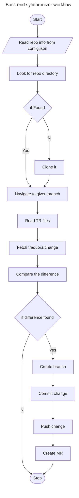
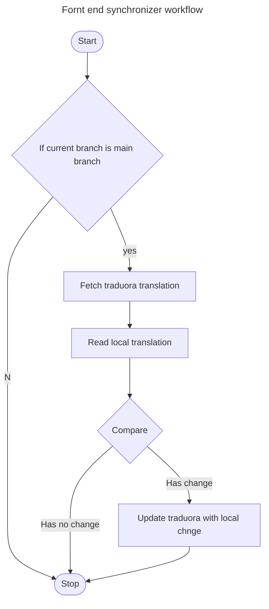

```mermaid
---
title: Back end synchronizer workflow
---
graph TD
   id1([Start]) --> id2[/Read repo info from config.json/];
   id2[/Read repo info from config.json/] --> id3["Look for repo directory"];
   id3["Look for repo directory"] --> id4{if Found};
   id4{if Found} --No-->id5["Clone it"];
   id4{if Found} --Yes-->id6["Navigate to given branch"];
   id5["Clone it"]-->id6["Navigate to given branch"]
   id6["Navigate to given branch"]--> id7["Read TR files"];
   id7["Read TR files"]--> id8["Fetch traduora change"];
   id8["Fetch traduora change"]--> id9["Compare the difference"];
   id9["Compare the difference"]--> id10{if difference found};
   id10{if difference found}--No-->id11([Stop]);
   id10{if difference found}--yes-->id12["Create branch"];
   id12["Create branch"]-->id13["Commit change"];
   id13["Commit change"]-->id14["Push change"];
   id14["Push change"]-->id15["Create MR"];
   id15["Create MR"]-->id11([Stop]);
```

```mermaid
---
title: Fornt end synchronizer workflow
---
graph TD
   id1([Start]) --> id2{If current branch is main branch};
   id2{If current branch is main branch}--No--> id3([Stop]);
   id2{If current branch is main branch}--yes--> id4["Fetch traduora translation"];
   id4["Fetch traduora translation"]--> id5["Read local translation"];
   id5["Read local translation"]--> id6{Compare};
   id6{Compare}--Has no change-->id3([Stop]);
   id6{Compare}--Has change-->id7["Update traduora with local chnge"];
   id7["Update traduora with local chnge"]-->id3([Stop])
   
```